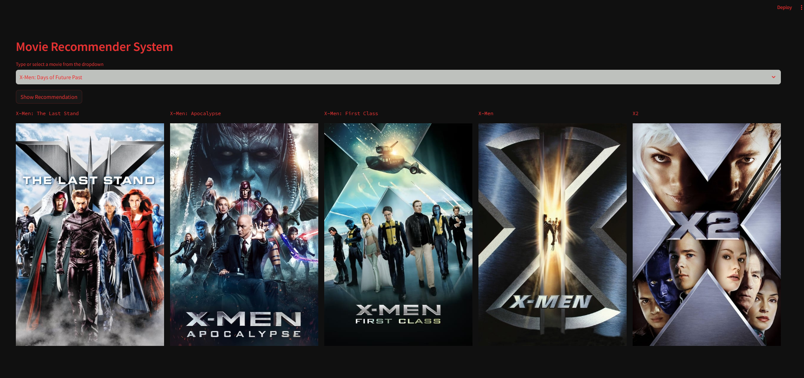
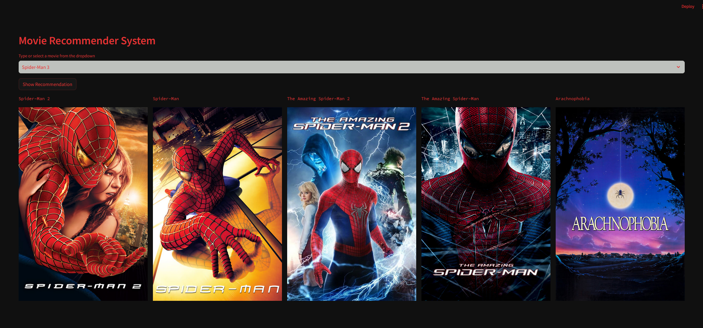

# Movie-Recommender-System


## Overview

This repository contains the code for my content-based movie recommender system. The recommender system is designed to provide personalized movie recommendations based on the content features of movies, such as genres, actors, and directors.

## Features

- **Data Collection:** The system utilizes a dataset containing information about various movies, ensuring data cleanliness and proper formatting. i collect the data from [here](https://www.kaggle.com/datasets/tmdb/tmdb-movie-metadata)

- **Feature Extraction:** Relevant features, including genres, actors, and directors, are extracted to create a feature matrix that represents each movie.

- **Similarity Calculation:** Similarity between movies is calculated using various metrics like cosine similarity, Jaccard similarity, or Euclidean distance.

- **Recommendation Generation:** Given a user's liked movies, the system identifies similar movies based on content and generates recommendations sorted by similarity score.


**Output**


## Usage

1. **Clone the Repository:**
[link](https://github.com/niloycste/Movie-Recommender-System)


2. **Install Dependencies:**


3. **Run the Recommender System:**
 ```bash
 streamlit run app.py 
 ```

4. **Input User Preferences:**
Use the user interface to input movie preferences and receive personalized recommendations.

## Future Improvements

- [ ] Explore and experiment with additional features for improved recommendations.
- [ ] Enhance the user interface for a more intuitive experience.
- [ ] Implement a user feedback mechanism to refine the recommendation algorithm.

## Acknowledgements

- This project is inspired by `Bappy Ahmed`

Feel free to explore the code, contribute, and provide feedback. If you have any questions or suggestions, please open an issue or reach out via email.

Happy movie exploring!


